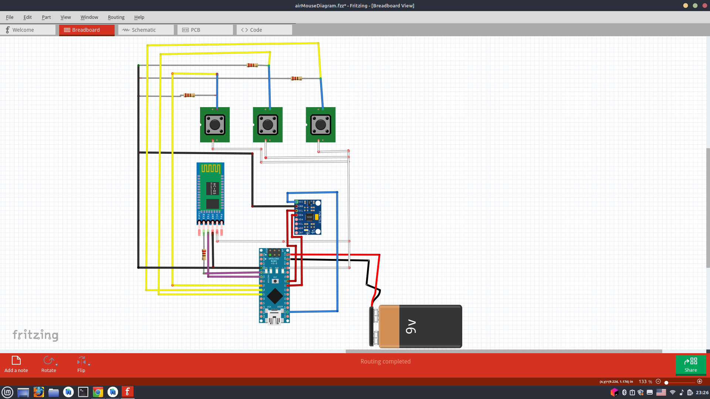

# Motivation:

Our  inspiration  for  this  project  came  from  observing  how  our  professors  utilize  projectors  in  their  teaching  methods. However, we  noticed a significant  challenge  that  they  faced: a lack  of  interaction  with  the  projected  content  when  the  teacher  was  away  from  their  desk  discussing a particular  topic.

To address  this  issue, we  recognized  the  need  for a solution  that  would  enable  teachers  to  maintain  control  over  their  computers  while  freely  moving  around  the  classroom. By combining  remote  computer  control  capabilities  with  the  use  of  projectors, we  aim  to  enhance  the  effectiveness  of  explaining  various  subjects.

# Product description:

**Airmouse**  is a computer  mouse  that  controls  the  cursor  using  motion-sensing  technology  and  does  not  require a desk. You can  control  the  cursor  by  waving  the  mouse  in  the  air  as  if  you  were  pointing  to  where  you  want  the  cursor  to  go. It was  created  solely  with  Arduino  hardware  and  software.

# Hardware:

1.  Arduino  Nano
    

2.  MPU6050 (Gyro  Sensor)
    

3.  HC-06 Bluetooth module (It should  work  for HC-05 too)
    

4.  Three 10KΩ Resistors
    

5.  One 2KΩ Resistor
    

6.  Three  push  buttons
    

#### NOTE: Resistors  can  be  default  high  or  default  low. We used  default  low  resistors  so  in  the  Arduino  code  we  set: if(digitalRead(MouseB) == HIGH){...}. If  default  high  resistor  is  used  code  should  be  set  like: if(digitalRead(MouseB) == LOW){...}. We didn’t  find a way  to  determine  the  type  of  resistor  just  by  looking  at  it. But  it  can  be  determined  by  testing  with  python  script. When  you  use  default  high  resistor  and  in  the  Arduino  code  you  set  if(digitalRead(MouseB) == HIGH){...}  then  you  will  have  your  cursor  moving  and  clicking  left  and  right  buttons  without  you  even  doing  anything.

   

#### NOTE: 2K resistor should be used when connecting Bluetooth RXD pin to Arduino Nano. It is called a voltage divider brige. We use this because some HC-06 modules operate at 3V3 and do not support the 5V voltage level on pin Rx. More on this in https://www.aranacorp.com/en/arduino-and-bluetooth-module-hc-06/.

# Software:

1.  Arduino IDE
    

2.  MPU6050 Library from [https://github.com/tockn/MPU6050_tockn](https://github.com/tockn/MPU6050_tockn)
    

3.  Python 3
    

4.  ‘pynput' Python library (`pip  install  pynput`)
    

5.  ‘pyserial’ Python library (`pip  install  pyserial`)
    

# How  to  run  and  start  airmouse:

1.  Clone  this  repo
    

2.  Open `arduino_sketch.ino` file  in  Arduino IDE
    

3.  Load  the  arduino  code  to  Arduino  Nano
    

4.  Find  and  connect  to a bluetooth  module. It can  be  found  by  name **HC-06**. It asks  for  password, type in **1234**. If  this  password  doesn’t  work, probably  it  was  reconfigured. And you  can  configure  the  password  to  whatever  you  want.
    

5.  Open `airmouse.py` python  code:
    

    1.  Install  dependencies:
    

        1.  `pip  install  pyserial`
    

        2.  `pip  install  pynput`
    

6.  Run  python  script:
    

    1.  **YOUR_BLUETOOTH_PORT** should  be  set  to an actual bluetooth  port. On Windows it  is  usually ‘COM-6’ or ‘COM-7’. Exact  port  number  on Windows can  be  found  in  bluetooth  settings. On Unix-like  systems  bluetooth  port  is  usually ‘/dev/tty.HC-06’. It can  be  found  by a command: ‘ls /dev/*’
    

    2.  `python airmouse.py`
    

    7.  Press buttons  and  play  with  it.
